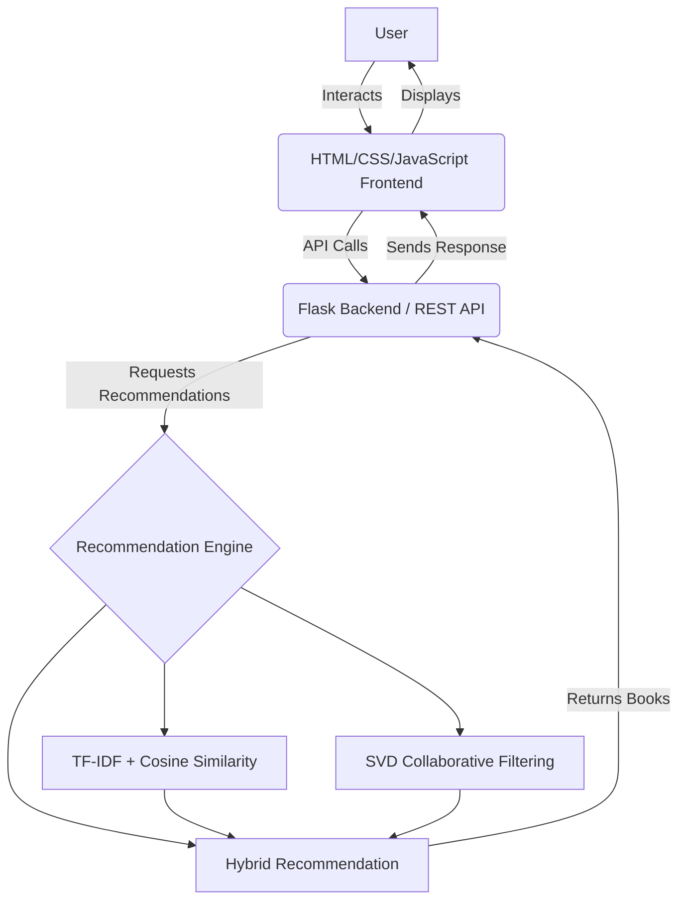

# Personalized Book Recommendation System

## Project Overview
This project aims to build a personalized Book Recommendation System using Machine Learning. It is designed to recommend books according to the user's preferences and previous ratings by combining both content-based and collaborative filtering approaches. This hybrid strategy leverages the strengths of both methods to provide accurate, tailored book suggestions.

## Key Features
*Note: The project repository is currently being initialized. The following features are **Planned** for future implementation:*
- **Personalized book recommendations** (Planned)
- **Search for books** (Planned)
- **Select a favorite book** (Planned)
- **Content-based recommendations** (Planned)
- **Collaborative filtering recommendations** (Planned)
- **Hybrid recommendations** (Planned)
- **Book ratings** (Planned)
- **User-based personalization** (Planned)
- **Clean web interface** (Planned)
- **Flask REST API/backend** (Planned)

## Recommendation Methodology (Planned Pipeline)
The machine learning pipeline will consist of the following approaches:

### A. Content-Based Filtering
- Use book metadata (e.g., author, publisher, title).
- Preprocess relevant text fields.
- Combine appropriate book information.
- Apply TF-IDF Vectorization.
- Calculate Cosine Similarity.
- Recommend books similar to the user's selected/favorite books.

### B. Collaborative Filtering
- Use User-ID, ISBN/Book-ID, and Book-Rating.
- Train an SVD (Singular Value Decomposition) based collaborative filtering model.
- Predict ratings for books that the user has not rated.
- Generate personalized recommendations.

### C. Hybrid Recommendation
- Combine content-based similarity scores and collaborative filtering predictions.
- The final hybrid scoring approach will weight the recommendations from both models.
- The exact weights can be configured and tuned once the models are trained and implemented.

## System Architecture (Proposed)


## Project Workflow (Planned)
1. **Dataset** &rarr; Download and load the data.
2. **Data preprocessing** &rarr; Clean data, handle missing values.
3. **Feature engineering** &rarr; Create necessary features for ML.
4. **TF-IDF model** &rarr; Train content-based model.
5. **SVD model** &rarr; Train collaborative model.
6. **Hybrid recommendation** &rarr; Combine both models.
7. **Flask API** &rarr; Serve recommendations via REST.
8. **Frontend** &rarr; Create user interface.
9. **User recommendations** &rarr; Display to user.

## Project Structure
*Currently, the repository only contains this README. The following structure is proposed for future implementation:*

```text
book-recommendation-system/
├── app.py
├── requirements.txt
├── README.md
├── data/
│   ├── Books.csv
│   ├── Ratings.csv
│   └── Users.csv
├── models/
│   ├── tfidf_model.pkl
│   ├── cosine_similarity.pkl
│   └── svd_model.pkl
├── ml/
│   ├── preprocess.py
│   ├── train_tfidf.py
│   ├── train_svd.py
│   └── recommender.py
├── templates/
│   └── index.html
└── static/
    ├── css/
    │   └── style.css
    └── js/
        └── script.js
```

## Installation (Proposed Instructions)
*Once the project is implemented, the installation steps will be:*

### Setup Steps
1. **Clone the repository:**
   ```bash
   git clone https://github.com/anshika1179/gcf-aiml.git
   cd gcf-aiml
   ```

2. **Create and activate a virtual environment:**
   - **Windows:**
     ```cmd
     python -m venv venv
     venv\Scripts\activate
     ```
   - **Linux/macOS:**
     ```bash
     python3 -m venv venv
     source venv/bin/activate
     ```

3. **Install dependencies:**
   ```bash
   pip install -r requirements.txt
   ```

4. **Download Dataset:**
   Download the Kaggle Book Recommendation Dataset and place `Books.csv`, `Ratings.csv`, and `Users.csv` into the `data/` directory.

5. **Train ML Models:**
   ```bash
   python ml/train_tfidf.py
   python ml/train_svd.py
   ```

6. **Start the Flask Server:**
   ```bash
   python app.py
   ```

## Flask API Documentation
*No endpoints are currently implemented in the repository. Once the Flask backend is developed, actual endpoints will be documented here.*

## Machine Learning
*Planned Implementation Details:*
- **Data Preprocessing**: Handling missing values, filtering users/books with sufficient ratings to reduce noise and sparsity.
- **TF-IDF**: Transforming book metadata into a document-term matrix.
- **Cosine Similarity**: Measuring the angle between TF-IDF vectors to find similar books.
- **SVD**: Matrix factorization technique to uncover latent features of users and books for predicting unknown ratings.
- **Hybrid Recommendation**: Combining scores from TF-IDF and SVD to mitigate the cold-start problem and improve overall accuracy.
- **Training Process**: Scripts to fit the models on the Kaggle dataset.
- **Model Persistence**: Serializing models using `pickle` for fast inference.
- **Recommendation Generation**: Logic to accept user input and return a ranked list of book predictions.

## Evaluation
*Once implemented, the models will be evaluated using the following metrics:*
- **Collaborative Filtering:**
  - **RMSE** (Root Mean Square Error)
  - **MAE** (Mean Absolute Error)
- **Recommendation Quality:**
  - **Precision@K**
  - **Recall@K**

*(Note: Actual model scores are not yet available as the project is in the planning phase).*

## Example User Flow (Planned)
1. User opens the website.
2. User searches or selects a book they like.
3. System identifies user preferences.
4. Recommendation engine processes preferences.
5. TF-IDF finds similar books (Content-based).
6. SVD predicts user preferences (Collaborative).
7. Hybrid engine combines results from both approaches.
8. Top recommended books are displayed to the user.

## Screenshots
*(Screenshots of the web interface will be added here once the frontend is implemented).*

## Future Improvements
- Better user profiles
- More advanced NLP embeddings (e.g., Word2Vec, BERT)
- Neural collaborative filtering
- Better cold-start handling
- More detailed book metadata integration
- User feedback loop to improve recommendations
- Recommendation explanations for users
- Deployment using a cloud platform (e.g., Heroku, AWS, Render)

## Limitations (Anticipated)
- **Cold-start problem:** New users without ratings or new books without metadata are harder to recommend.
- **Sparse ratings:** The dataset has a highly sparse user-item interaction matrix.
- **Limited metadata:** Relying only on title/author/publisher might limit content-based recommendations.
- **Popularity bias:** Collaborative filtering tends to recommend globally popular books more frequently.
- **Dataset limitations:** The Kaggle dataset is static without real-time updates.

## Dataset and Attribution
This project uses the **Book Recommendation Dataset** from Kaggle.

## License
This project does not currently specify a separate software license.
